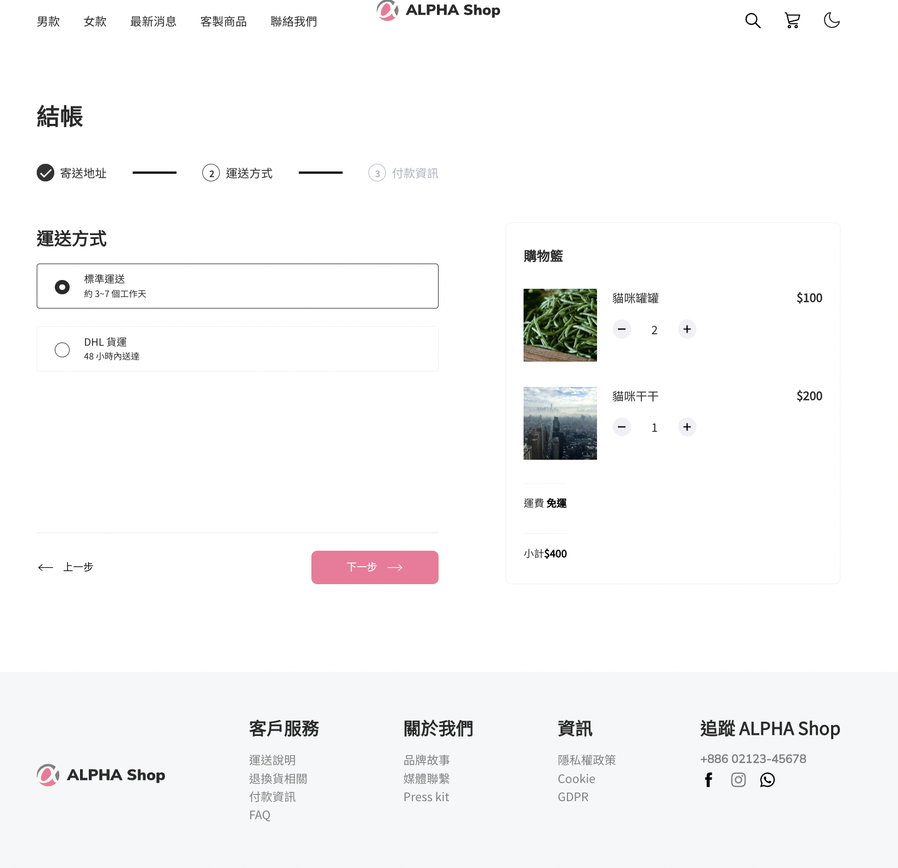

# 學期三 AlphaShop_basic

## 專案目的：以 React 實作開發電商網站（基礎版)

1.V1~V2 包含的功能： 靜態畫面以 JSX 呈現，並將 JSX 內容以 function component 做元件切分

2.V3 新增的功能: 各步驟的 Progress，可依照點擊的行為，前往或返回上下步驟，並如實呈現其步驟的內容；購物清單的產品資料，改以動態渲染的方式呈現，同時可於產品數量的增減選項上做點擊

## 環境設置 :

node.js - 14.18.1

npm - 6.14.15

React - 18.2.0

## 使用方法

1.打開終端機 Terminal；

2.輸入指令以下載本專案：`https://github.com/cching01099/alphashop_basic.git`

3.進入專案資料夾：`cd ALPHA-shop`

4.安裝 npm：`npm install`

5.啟動 npm：`npm start`

6.在您的瀏覽器輸入以下網址以瀏覽本專案： `http://localhost:3000` - 完成
